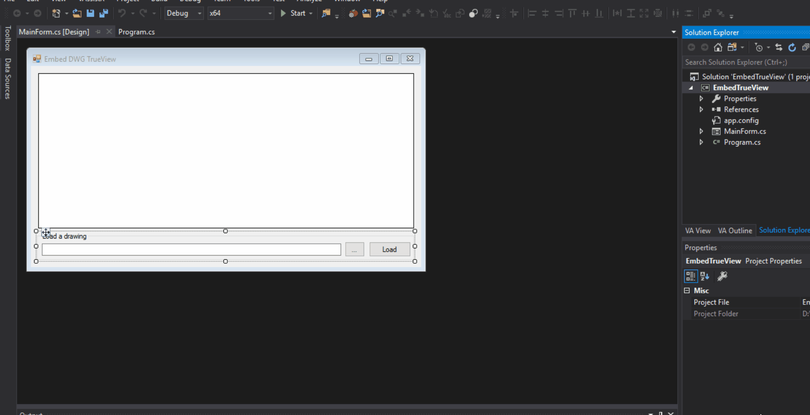

# Step By Step Guide To Embed AutoCAD Drawing Viewing Control [dwgviewrAcCtrl.dll]

1. Install Autodesk True view, refer here to get [latest](https://knowledge.autodesk.com/support/dwg-trueview/learn-explore/caas/sfdcarticles/sfdcarticles/Where-to-download-previous-versions-of-DWG-TrueView.html)

2. Find `dwgviewrAcCtrl.dll`, this file is located in `"C:\Program Files\Common Files\Autodesk Shared\dwgviewrAcCtrl.dll"`.

3. Launch Visual Studio 2017 Developer Command Prompt or launch `cmd.exe` in administrator mode, 

   1. `cd /d "C:\Program Files\Common Files\Autodesk Shared"`
   2. run `call "%VS140COMNTOOLS%"\vsvars32.bat`. This will set VS 2017 developer environment. This step is required if you are launching `cmd.exe`
   
4. `regsvr32 dwgviewrAcCtrl.dll`, A dialog will pop up that DLL registration is successful

   

   

5. We will use `aximp`  this ActiveX Control Importer converts type definitions in a COM type library for an ActiveX control into a Windows Forms control. 

6. Clone the project.

   1. `git clone `https://github.com/MadhukarMoogala/EmbedTrueView.git

   2. `cd EmbedTrueView\EmbedTrueView`

   3. `devenv EmbedTrueView.sln`

   4. add `C:\Program Files\Common Files\Autodesk Shared` as reference directory.

      

      